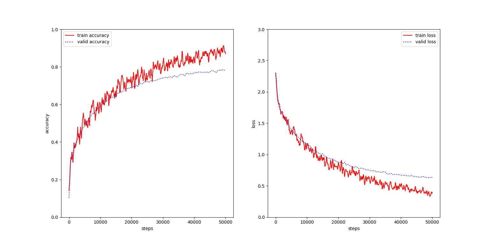
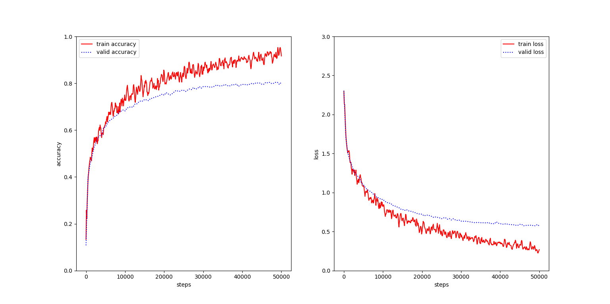
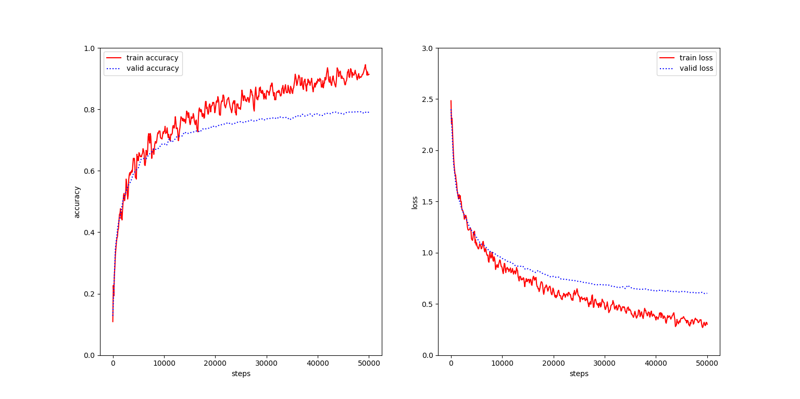
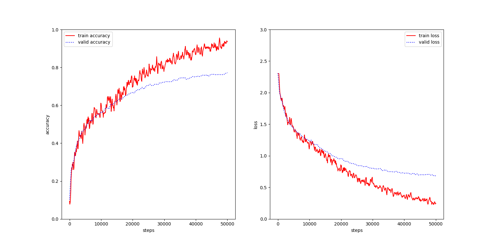
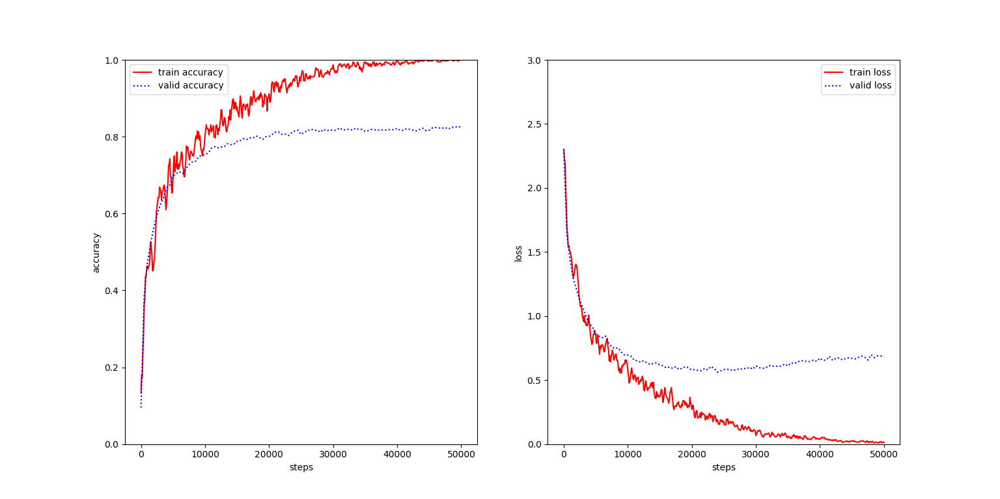
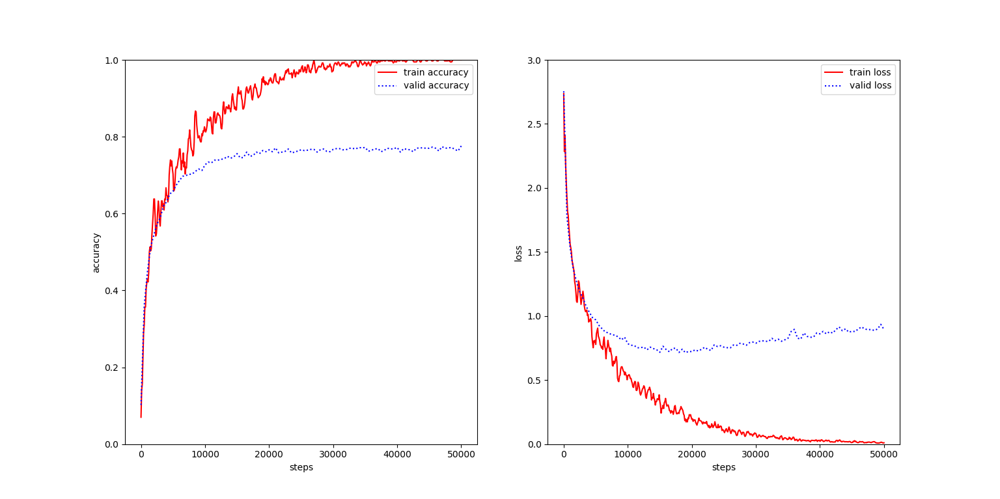

# cifar-10-Tensorflow
cifar-10 training and test with CNN  with Tensorflow.

## dependence
- Python 2.7 or Python3.x (modify some codes, see codes)
- numpy
- matplotlib
- TensorFlow >= 1.3.0

## train the model
```sh
python train.py --model model_name --init init_method
```
for example, if you want to train the model with "cifar10-5layers" and "Gaussian" method, running the codes followed:

```sh
python train.py --model "cifar10-5layers" --init "Gauss"
```
I also provided a shell for you to run all training process at once in Linux:
```bash
time train.sh
```
## test the model

```python
python test.py --model model_name --path model_path
```
for example:

```python
python test.py --model "cifar10-5layers" --path "models/cifar10-5layers_Gaussian-50000.data-00000-of-00001"
```

test all models at once in Linux:

```bash
test.sh
```

## Experimental results
- learning rate = 0.001
- training methods = Adam
- steps = 50,000
- GPU = NVIDIA 1070

### cifar10\_5layers
- Gaussian initialization
```
python train.py --model "cifar10-5layers" --init "Gauss"

test accuracy = 0.7814
```



- Xavier initialization
```
python train.py --model "cifar10-5layers" --init "Xavier"

test accuracy = 0.8081
```

- He initialization
```
python train.py --model "cifar10-5layers" --init "He"

test accuracy = 0.7968
```


### cifar10\_8layers
- Gaussian initialization
```
python train.py --model "cifar10-8layers" --init "Gauss"

test accuracy = 0.7552
```



- Xavier initialization
```
python train.py --model "cifar10-8layers" --init "Xavier"

test accuracy = 0.8175
```



- He initialization
```
python train.py --model "cifar10-8layers" --init "He"

test accuracy = 0.7703
```

